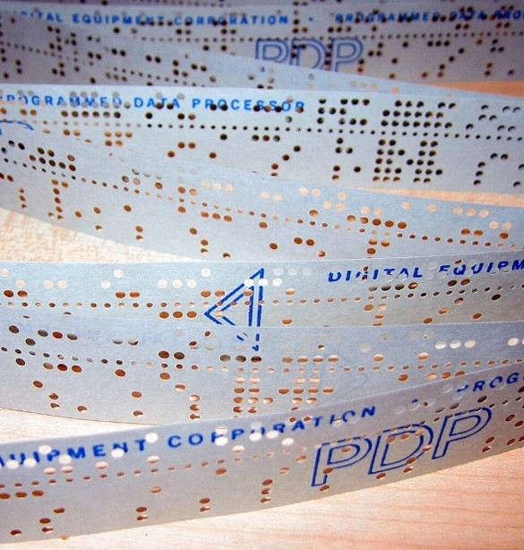

# 🚀 [Lancer l'activité](https://nablanabla.github.io/Carte-perfor-e/)

## La Carte Perforée — Activité Interactive

Activité pédagogique interactive sur le principe de la carte perforée et son lien avec le stockage binaire de l'information.

                
            

Développée pour le cours **Culture numérique en Sciences de la Santé** (Université Laval, DIEM).

## Objectifs pédagogiques

- Comprendre que toute information numérique repose sur deux états : présence ou absence (0 ou 1)
- Découvrir par l'exploration qu'avec 2 rangées de trous, on encode 2² = 4 symboles distincts
- Faire le lien entre le principe de la carte perforée (1725) et le séquençage de l'ADN
- Simuler le fonctionnement d'une tête de lecture mécanique

## Structure de l'activité

L'activité se déroule en trois étapes linéaires :

**Étape 1 — Exploration libre**
L'étudiant perfore librement les trous d'une carte simplifiée (12 colonnes × 2 rangées) et découvre progressivement les 4 combinaisons possibles, correspondant aux 4 bases azotées de l'ADN : A (00), T (01), G (10), C (11).

**Étape 2 — Encodage dirigé**
L'étudiant encode la séquence `ATG ATC TCG TAA` — un cadre de lecture biologique complet avec codon START, deux codons internes (Isoleucine, Sérine) et codon STOP.

**Étape 3 — Simulation de la tête de lecture**
Une animation montre une tête de lecture parcourant la carte de gauche à droite, décodant la séquence en temps réel.

## 👨‍🏫 Auteur

**Alban Da Silva**  
Chargé d'Enseignement en Médecine - Faculté de Médecine  
Université Laval, Québec, Canada

**Contexte :** Cours "Culture Numérique en Sciences de la Santé"
